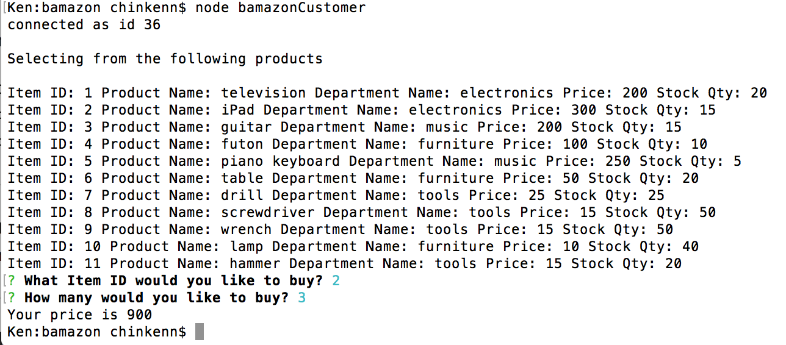
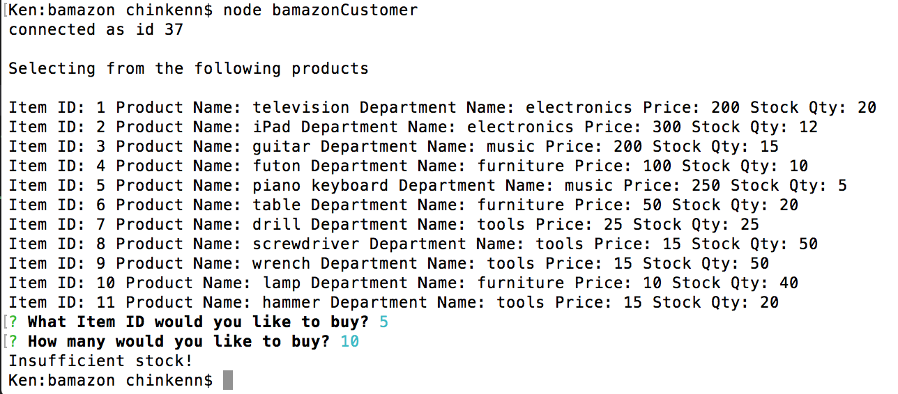
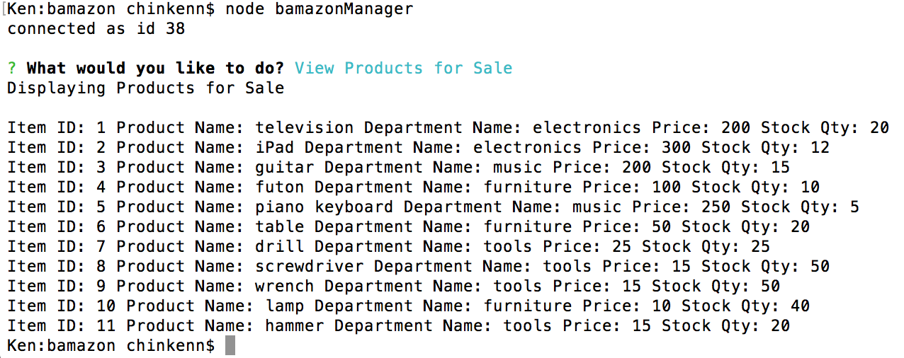
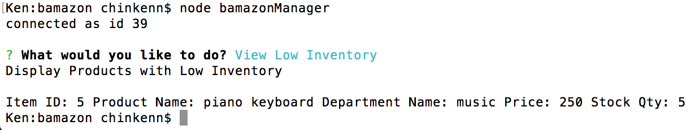
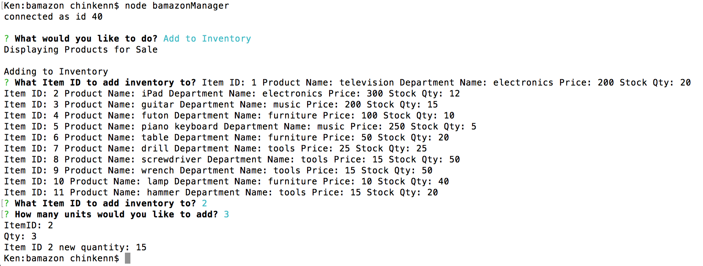
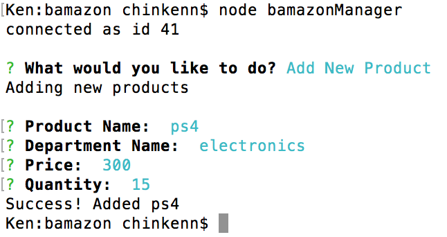

# bamazon
## bamazonCustomer.js

## bamazonCustomer.js Insufficient Quantity

## bamazonManager.js View Product

## bamazonManager.js Low Inventory Quantity

## bamazonManager.js Add Inventory

## bamazonManager.js Add Item
